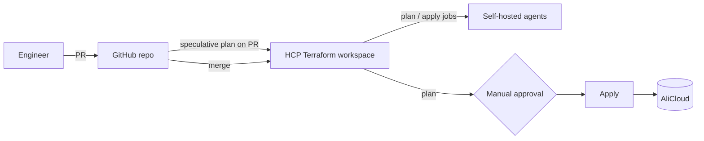
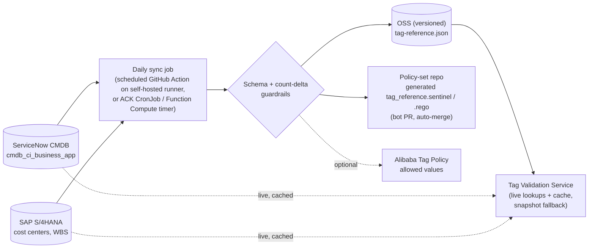
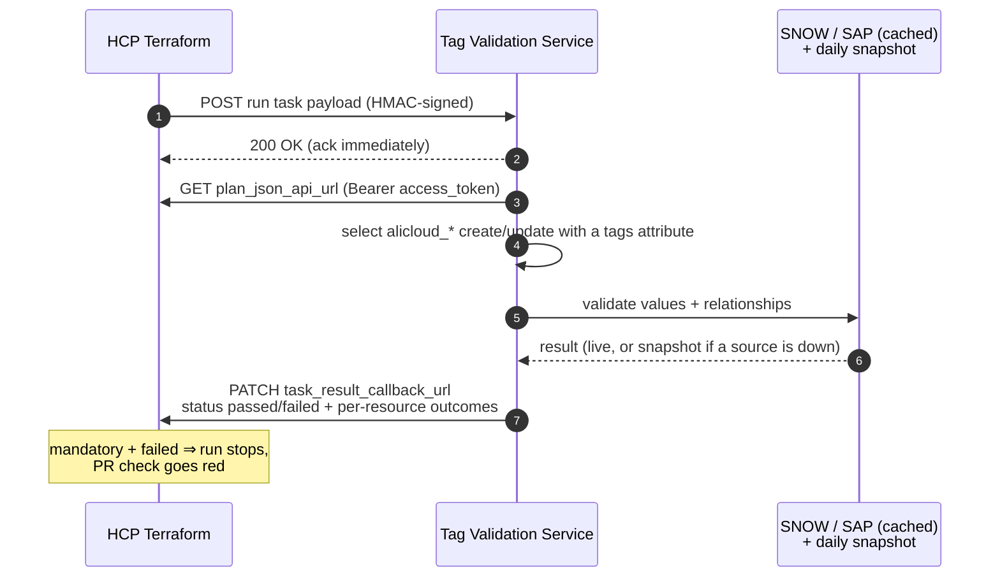
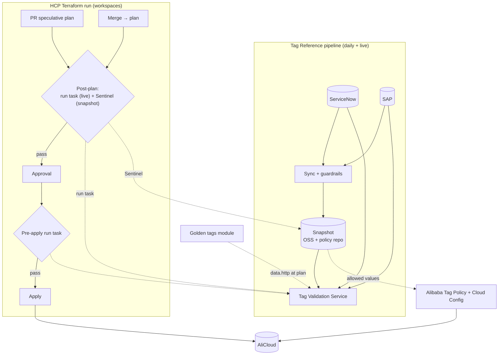

# Validating ServiceNow and SAP tag values on AliCloud resources in HCP Terraform

| | |
|---|---|
| **Status** | Proposal for review |
| **Date** | 2026-09-28 |
| **Scope** | AliCloud infrastructure deployed by HCP Terraform (VCS-driven from GitHub, plan → approval → apply, self-hosted agents) |
| **Question** | How do we check, at plan and apply time, that mandatory tag *values* (application owner, business owner, cost center, WBS code, …) are valid in ServiceNow and SAP, with a daily static file as a fallback? |

---

## 1. Summary

**The gap:** Checking that a tag *exists* is easy. The hard part is proving the value is *true*: that the owner really owns the application in ServiceNow, that the cost center is active in SAP, and that the WBS element is released and belongs to that cost center.

**Recommendation:** Build one shared **Tag Reference pipeline** (ServiceNow + SAP → cached live lookups + a daily snapshot). Then enforce it at the layers below:

| # | Option | What it gives you | Verdict |
|---|---|---|---|
| **1** | **Custom run task + Tag Validation Service** | Live, relational ServiceNow/SAP checks on every plan, including PR speculative plans, and again just before apply. Results are shown per resource in the HCP Terraform run UI. | ⭐ **Primary gate** |
| **2** | **Sentinel policy set against a daily snapshot** (an OPA variant is possible) | Deterministic baseline with no runtime dependency. This *is* the "static file" fallback. | ✅ **Ship first** (quick win) and keep as the safety net |
| **3** | **"Golden tags" Terraform module** (`data "http"` + postcondition) | Fast feedback while writing code, and consistent tags (the AliCloud provider has no `default_tags`). It is the only in-platform option that also works for **HCP Terraform Stacks** today. | ✅ Developer experience layer, but not a control on its own |
| **4** | **Alibaba Cloud Tag Policy + Cloud Config** | Blocks or flags bad tags on resources created *outside* Terraform, and catches drift | ✅ Runtime backstop |
| – | *Terraform policy (HCL, beta)* | Native HTTP lookups, post-apply evaluation, Stacks support | 👀 Watch; re-evaluate at GA |

**Two facts change the design. Please confirm them:**

1. **HCP Terraform edition.** On **Premium**, run tasks and policy evaluations can execute *inside your network* through your self-hosted agents, so nothing is exposed inbound. On **Standard**, the run task endpoint must be reachable from HCP Terraform's published IP ranges, and hosted policy evaluations cannot reach private APIs.
2. **Workspaces or HCP Terraform Stacks?** Stacks support **neither run tasks nor Sentinel/OPA** today. If "IaC stacks" means HCP Terraform *Stacks*, use Options 3 and 4 until Terraform policy is GA.

---

## 2. Context and assumptions



### 2.1 Tag contract (assumed; adjust key names to your standard)

| Tag key | Source of truth | Rule to enforce |
|---|---|---|
| `ApplicationID` *(recommended new anchor)* | ServiceNow `cmdb_ci_business_app.number`, e.g. `APM0001234` | Exists and is operational |
| `ApplicationOwner` | ServiceNow `cmdb_ci_business_app.it_application_owner` | Equals the IT owner **of that application** |
| `BusinessOwner` | ServiceNow `cmdb_ci_business_app.owned_by` | Equals the business owner **of that application** |
| `CostCenter` | SAP S/4HANA cost center master data | Exists, is valid today, and is not locked |
| `WBSCode` | SAP S/4HANA WBS element (Enterprise Project) | Exists, is released and not closed, and belongs to `CostCenter` (if that is your finance rule) |

> **Why add `ApplicationID`?** Without an anchor you can only ask "is this a real person or a real cost center?", so `ApplicationOwner = <any employee>` would pass. With the anchor, owners and finance codes are checked **against each other**, which is what FinOps and the CMDB actually need. It also makes every cloud resource joinable to its CMDB record.

### 2.2 What "plan time" and "apply time" mean here

| Moment | Mechanism | Why it matters |
|---|---|---|
| **PR opened** | HCP Terraform runs a *speculative plan* and posts its status to the PR. Policies and run tasks run on it too. | Make that status a **required check** in branch protection and bad tags never reach `main`. |
| **After merge, before approval** | Post-plan run task / policy evaluation | This is the blocking gate on the real run. |
| **Right before apply** | Pre-apply run task | Revalidates after a slow approval, since a WBS can close in between. |
| **After apply / continuously** | Post-apply run task, Alibaba Cloud Tag Policy / Config | Catches drift, console-created resources, and CMDB registration. |

---

## 3. Platform facts that drive the design

Verified against HashiCorp's documentation source (`hashicorp/web-unified-docs` @ `a6140de`, 2026-09-28) and the provider repositories. See [Sources](#sources).

| # | Fact | Design impact |
|---|---|---|
| F1 | Run tasks can run at **pre-plan, post-plan, pre-apply and post-apply**, with **advisory** or **mandatory** enforcement. A mandatory task that fails (including a timeout) stops the run. | You can gate both after the plan and right before the apply. |
| F2 | A run task gets a short-lived `access_token` and a `plan_json_api_url`, and must call back within **10 min** (progress) / **60 min** (total). The payload carries `is_speculative`. Results can include per-item **outcomes** shown in the UI. Requests are HMAC-SHA512 signed (`X-Tfc-Task-Signature`). | The service is asynchronous and stateless. It works on PR plans. |
| F3 | Run task **source = Agent** (requests forwarded through your agents into private networks) needs **Premium**, plus agent ≥ 1.21.1 started with `-request-forwarding`. Otherwise HCP Terraform calls your URL from its `notifications` IP ranges. | This decides the network exposure of the service. |
| F4 | Free edition: 1 run task on ≤ 10 workspaces. Org-wide ("global") run tasks need the `global-run-tasks` entitlement (beta); otherwise scope them to projects. | Scope the task at the project level. |
| F5 | Policy frameworks: **Sentinel, OPA, Terraform policy**. Legacy Sentinel *policy checks* support Sentinel ≤ 0.40.x only, so use **policy evaluations**. OPA runs only as a policy evaluation. | Create the Sentinel set with type **Agent** (policy evaluation). |
| F6 | A policy evaluation runs **on your agents** only if you are on **Premium**, the workspace uses agent execution mode, and an agent accepts `policy` jobs. Otherwise it runs in HCP infrastructure. | Live lookups from a policy into private SAP need Premium. |
| F7 | Sentinel's **`http` import** is usable in HCP Terraform policy sets (HashiCorp's own example uses it). Defaults: 10 s timeout, 1 retry, and any non-200 response is a policy error. The `sentinel` egress IP range applies to legacy policy checks only. | Hosted evaluations can't be IP-allowlisted, so live Sentinel lookups belong on Premium agents. |
| F8 | OPA in HCP Terraform receives `input.plan` / `input.run` and **cannot query external data** at evaluation time. Rego files are the only inputs. | Data has to come from a generated `.rego` snapshot. |
| F9 | **Terraform policy** (HCL) is **beta** ("do not use beta features in production"). It has `core::gethttprequest`, wildcard `resource_policy "alicloud_*"`, and post-apply evaluation, and requires Terraform ≥ 1.16. | Strong future fit, but not for production yet. |
| F10 | **Stacks:** run tasks ❌, policy as code ❌, except beta Terraform policy (which needs Terraform 1.17 alpha on Stacks). | Stacks need Option 3 and Option 4. |
| F11 | The AliCloud provider has **no provider-level `default_tags`**, and some resources are not taggable (e.g. RAM users). | Tags must be passed per resource, so a shared module is needed. Policies must skip untaggable types. |
| F12 | Alibaba Cloud **Tag Policy** can restrict allowed values per key, and with `enforced_for` it performs pre-event interception (blocks creation) for supported resource types. It is manageable as `alicloud_tag_policy`. **Cloud Config** has `required-tags` / `contains-tag` managed rules and Function Compute custom rules. | This is a cloud-side backstop. It works with allow-lists only and can't do relational checks. |

---

## 4. Shared foundation: the Tag Reference pipeline

Every option needs the same trusted data. Build it once, and it becomes the static fallback you asked for.



- **Extract (read-only technical users):**
  - *ServiceNow Table API:* `GET /api/now/table/cmdb_ci_business_app?sysparm_query=<operational filter>&sysparm_fields=number,it_application_owner.email,owned_by.email`. The dot-walked fields return owner emails in one call.
  - *SAP S/4HANA:* cost centers (valid today, not locked) and WBS elements (released, with responsible cost center) via the Cost Center API and the Enterprise Project API (`API_ENTERPRISE_PROJECT_SRV;v=0002` → `A_EnterpriseProjectElement`). Prefer going through SAP API Management or Integration Suite rather than calling S/4 directly.
- **Normalize:** lower-case emails, trim values, keep only active/released records, and record `generated_at` plus source counts.
- **Guardrails before publishing:** validate against a JSON schema, and **refuse to publish if record counts drop by more than ~5%**. A bad extract must never wipe out the allow-lists and block every deployment.
- **Freshness SLO:** alert when the snapshot is older than 26 h. The policies fail when it is older than 48 h (configurable).
- **Snapshot shape** (the same data is rendered as JSON, a Sentinel module, and a Rego package):

```json
{
  "generated_at": "2026-09-28T02:00:00Z",
  "applications": { "APM0001234": { "app_owner": "jane.doe@example.com", "business_owner": "raj.k@example.com" } },
  "cost_centers": { "CC10001": { "company_code": "1000" } },
  "wbs_elements": { "P-100234.01": { "cost_center": "CC10001" } }
}
```

---

## 5. Options in detail

### Option 1 ⭐: Custom run task + Tag Validation Service (primary gate)

**How it works**



**Recommended stage configuration** (scope: the project(s) that hold AliCloud workspaces)

| Stage | Enforcement | Purpose |
|---|---|---|
| Post-plan | **Mandatory** | Main gate on PR speculative plans and on real runs |
| Pre-apply | Mandatory | Revalidate after approval, in case data changed while waiting |
| Post-apply | Advisory *(optional)* | Emit an audit event, or register created resources against the CMDB application |

**Network patterns**

| Edition | Run task source | How HCP Terraform reaches the service | How the service reaches SNOW / SAP |
|---|---|---|---|
| Standard | Managed | Public HTTPS endpoint (Alibaba ALB or API Gateway + WAF) that allowlists HCP Terraform `notifications` ranges (refresh daily from the IP ranges API) and verifies HMAC | Private (VPC, SAP via private connectivity) |
| Premium | **Agent** | Forwarded through ≥ 2 agents with `-request-forwarding`. **No inbound exposure.** | Private |

**Service design notes**
- Host it on **Function Compute** (HTTP trigger with async invocation) or as a small deployment on **ACK**. Acknowledge within seconds and do the work asynchronously through a queue, not an in-process thread.
- Cache live lookups (~15 min TTL). **If ServiceNow or SAP is unreachable, validate against the latest snapshot (≤ 48 h)** and add an `info` outcome saying so.
- Process the plan JSON **in memory only**; it can contain sensitive values. Use the `access_token` only for the plan fetch and the callback.
- Start from HashiCorp's scaffold ([`hashicorp/terraform-run-task-scaffolding-go`](https://github.com/hashicorp/terraform-run-task-scaffolding-go)); a tested Python sketch is in [Appendix D](#appendix-d-run-task-handler-sketch).

| ✅ Pros | ⚠️ Cons |
|---|---|
| Live data, with relational and complex rules (any logic, any source) | You own a service; its availability gates all AliCloud deployments |
| Per-resource results in the run UI; the same check blocks PRs | On Standard, the endpoint must be internet-reachable (HMAC + IP allowlist mitigate this) |
| Covers post-plan **and** pre-apply, and optionally post-apply | Not available for HCP Terraform Stacks |
| Language- and engine-agnostic; easy to extend (naming rules, budget checks, …) | Free edition limits: 1 task / 10 workspaces |

**Effort:** Medium. **Choose it when:** you need live or relational validation. That is your stated requirement.

---

### Option 2: Sentinel policy set on the daily snapshot (quick win and safety net)

**How it works.** A VCS-connected policy set (this repository) contains the policy plus a **generated Sentinel module** `tag_reference.sentinel`. The daily job updates the module through a bot PR, and HCP Terraform picks up every push automatically. The policy filters `alicloud_*` resources that are being created or updated and have a `tags` attribute, then checks presence, membership, relationships, and snapshot freshness.

```text
terraform-cloud-policies/
├── sentinel.hcl                                   # policy + module wiring
├── enforce-alicloud-mandatory-tags.sentinel       # the policy (Appendix A)
├── modules/tag_reference.sentinel                 # GENERATED daily - do not edit
└── test/enforce-alicloud-mandatory-tags/*.hcl     # sentinel test cases + mocks
```

- **Rollout:** `advisory` → `soft-mandatory` (named teams can override, and the override is audited) → `hard-mandatory`.
- **Policy set type: Agent** (policy evaluation), because legacy policy checks are frozen at Sentinel 0.40.x. On Premium with agent-mode workspaces it runs on your agents; otherwise it runs in HCP infrastructure. That is fine here because the snapshot needs **no network**.
- **Optional live mode:** a Sentinel module can use the `http` import to call the Tag Validation Service. Only do this on **Premium** (evaluation on your agents), because hosted evaluations have no published egress IPs. It **fails closed**, since a non-200 response is a policy error, so keep the snapshot as the default and put the fallback logic in the service.
- **OPA variant ([Appendix B](#appendix-b-opa-variant)):** the same pattern with a generated `tag_reference.rego`. Pick OPA only if you want one policy language across Terraform, Kubernetes (Gatekeeper) and CI (`conftest`). In HCP Terraform, OPA has only advisory and mandatory levels (mandatory is overridable by anyone with *Manage Policy Overrides*), and it cannot fetch data.

| ✅ Pros | ⚠️ Cons |
|---|---|
| No new runtime component, only the sync job; deterministic and cheap | Data is up to ~24 h stale (acceptable for owners and cost centers; tighten the schedule if needed) |
| Relational checks still work, because the snapshot carries the relationships | Snapshot lives in Git: prune it to active/released records only |
| Unit-testable with `sentinel test` mocks (Appendix A: 6/6 passing) | Messages are plain log lines, less rich than run task outcomes |
| Survives ServiceNow, SAP or service outages; a natural break-glass partner for Option 1 | Not available for Stacks; VCS-connected policy sets need Standard or higher |

**Effort:** Small. **Choose it when:** you want enforcement in 1–2 weeks, and as a permanent baseline under Option 1.

---

### Option 3: "Golden tags" Terraform module (shift-left developer experience)

**How it works.** A shared module takes a typed `tags` object, validates formats (e.g. `^APM[0-9]{7}$`), and calls the Tag Validation Service through `data "http"` with a `postcondition`. Every resource then uses `tags = module.tags.tags`. The plan executes on your **self-hosted agents**, so the internal API is reachable **on any edition** without Premium. The same check fails `terraform plan` locally and in CI. See [Appendix C](#appendix-c-golden-tags-module) (tested with Terraform 1.16.4 and `hashicorp/http` 3.6.2).

| ✅ Pros | ⚠️ Cons |
|---|---|
| Fastest feedback, with errors that point at the exact tag | **Opt-in, so it can be bypassed** (tags written inline); pair it with Option 1 or 2 for enforcement |
| Fixes AliCloud's missing `default_tags` with one consistent tag map | `data.http` arguments and responses are stored in state: send only tag values and use network-level or mTLS auth instead of bearer tokens |
| **Works for HCP Terraform Stacks** (in component modules) and for any runner | Plans fail if the API is down (mitigated by the snapshot fallback inside the API) |

**Effort:** Small. **Choose it when:** always. It is the paved road, and it makes Options 1 and 2 rarely fire.

---

### Option 4: Alibaba Cloud Tag Policy + Cloud Config (runtime backstop)

**How it works.** A platform workspace manages `alicloud_tag_policy` (RD mode, attached to folders or accounts). The allowed-value lists for keys such as `CostCenter` are rendered daily from the snapshot, and `enforced_for` gives **pre-event interception** on high-value resource types. **Cloud Config** runs `required-tags` plus a **Function Compute custom rule** that checks existing resources against ServiceNow/SAP and reports or remediates.

```json
{"tags": {"CostCenter": {
  "tag_key":      {"@@assign": "CostCenter"},
  "tag_value":    {"@@assign": ["CC10001", "CC20002"]},
  "enforced_for": {"@@assign": ["ecs:instance"]}
}}}
```

| ✅ Pros | ⚠️ Cons |
|---|---|
| Covers console, CLI and other-tool changes, plus drift and **existing** resources (plan-time checks only see resources that change) | Allow-lists only: **no relational checks** (owner ↔ app, WBS ↔ cost center) |
| Enforced by the cloud API itself; nothing to bypass for enforced types | Interception applies to supported resource types only; large WBS lists may hit policy-size limits (verify for your volumes) |
| Cloud Config gives the compliance reporting FinOps wants | Failures surface **mid-apply** as API errors (partial applies), which is a poor primary developer experience |

**Effort:** Small to medium. **Choose it when:** you need coverage beyond Terraform and a compliance inventory.

---

### Watch: Terraform policy (HCL framework, beta)

HashiCorp now recommends Terraform policy for new governance work. It adds exactly what this use case needs: `core::gethttprequest` with sensitive `input`s, `resource_policy "alicloud_*"` wildcards, **post-apply evaluation**, and **Stacks** support. It is **beta**, and HashiCorp says not to use it in production. At GA it could replace Options 1 and 2 with a single native policy set. Plan a spike, not a rollout.

---

## 6. Side-by-side comparison

| Criterion | 1 Run task ⭐ | 2 Sentinel snapshot | 3 Golden module | 4 Alibaba Tag Policy / Config |
|---|---|---|---|---|
| Live ServiceNow/SAP data | ✅ cached | ⚠️ daily (live only on Premium) | ✅ via API | ❌ daily allow-lists |
| Relational checks | ✅ | ✅ from snapshot | ✅ | ❌ |
| Blocks at PR (speculative plan) | ✅ | ✅ | ✅ | ❌ |
| Blocks before apply | ✅ post-plan + pre-apply | ✅ post-plan | ✅ plan fails | ⚠️ during apply |
| Can developers bypass it? | No, if scoped at org/project level and teams lack run-task permissions | No; overrides are permission-gated and audited | **Yes** | No (enforced types) |
| Non-Terraform resources and drift | ❌ | ❌ | ❌ | ✅ |
| HCP Terraform Stacks | ❌ | ❌ | ✅ | ✅ |
| Private SNOW/SAP reachability | Premium: agent forwarding · Standard: exposed endpoint | Not needed (snapshot) | ✅ via your agents | Function Compute in your VPC |
| New component to operate | Service | Sync job only | Uses service API | None |
| Failure UX | Per-resource outcomes in UI | Policy log lines | Plan error with exact tag | Cloud API error |
| Effort | M | S | S | S–M |

---

## 7. Recommended target architecture and rollout



**Phased rollout** (timings indicative)

| Phase | Weeks | Deliverables | Exit criteria |
|---|---|---|---|
| 0: Decide | 0 | Tag contract and `ApplicationID` anchor; edition; workspaces vs Stacks; fail-closed rules; exception process | Signed off by FinOps and CMDB owners |
| 1: Baseline | 1–2 | Sync job + snapshot; Sentinel set in **advisory** on AliCloud projects; speculative plans on and **HCP Terraform status required in GitHub branch protection**; golden module v1 | Violation baseline measured, false positives < 5% |
| 2: Live gate | 3–6 | Tag Validation Service; run task post-plan **advisory → mandatory**, then pre-apply; Sentinel → **hard-mandatory**. Enforcement levels are per policy, so use a `create`-only copy of the policy as hard-mandatory and keep the `create`+`update` version advisory until legacy resources are backfilled | All AliCloud workspaces gated |
| 3: Backstop | 6–10 | Alibaba Tag Policy (enforced for top resource types); Cloud Config custom rule; remediation campaign for existing resources | Compliance dashboard > 95% |
| 4: Converge | At GA | Spike on Terraform policy; consider collapsing Options 1 and 2 into it (and use it for Stacks) | Decision record |

> **Legacy resources:** an `update` to an old, untagged resource will fail the check even if the change is unrelated. Enforce on `create` first and `update` a few weeks later, and use Option 4's inventory to drive the backfill.

---

## 8. Operations and security checklist

**Failure modes (designed to fail safe, with a break-glass path)**

| Failure | Run task (1) | Sentinel snapshot (2) | Golden module (3) |
|---|---|---|---|
| ServiceNow/SAP API down | Validates from snapshot; no impact | No impact | API validates from snapshot |
| Snapshot job failing | Live checks continue | Policy fails after 48 h (alert at 26 h) | No impact |
| Tag Validation Service down | Mandatory task fails, so runs block. **Break-glass:** switch the task to advisory while Sentinel keeps enforcing | No impact | Plan fails (same break-glass) |

- **Secrets:** ServiceNow and SAP read-only OAuth clients held in Alibaba **KMS Secrets Manager**; never in application workspace variables. Mark Sentinel parameters as sensitive. Rotate the run task HMAC key.
- **Endpoint hardening (Standard):** TLS, HMAC verification, WAF allowlist of HCP `notifications` ranges refreshed daily. On Premium, prefer agent request forwarding so there is no inbound path.
- **Data handling:** never log the plan JSON; it can contain secrets.
- **Integrity of the snapshot:** bot identity with signed commits, CODEOWNERS on the non-generated policy files, and schema plus count-delta checks before publishing.
- **Exceptions:** soft-mandatory override restricted to a named team; require a ServiceNow ticket reference in the justification. Overrides are audit-logged by HCP Terraform.
- **Correctness details:** tag values must be **known at plan time**. Terraform omits unknown values from the plan's `after` and flags them in `after_unknown`, so the policies explicitly reject tags that are unknown until apply rather than silently skipping them. Alibaba tags are case-sensitive, so normalize owner emails. Skip non-taggable types by checking for a `tags` attribute.
- **Observability:** validation latency, source error rate, snapshot age, and violations per project. A post-apply webhook to ServiceNow (Service Graph Connector for Terraform; AliCloud needs custom ETL mappings) closes the CMDB loop.

---

## 9. Open decisions

1. HCP Terraform **edition** (Standard vs Premium). This decides run task exposure and whether live policy lookups are possible.
2. **Workspaces or Stacks**, now and planned.
3. Final **tag keys** and adoption of `ApplicationID` as the anchor.
4. Which **relational rules** are mandatory (e.g. WBS → cost center).
5. **Fail-closed vs fail-open** thresholds (snapshot age, service outage).
6. **Exception process** and who holds override rights.
7. **SAP access path** (API Management, Integration Suite, or direct OData) and ownership of the sync job.
8. **Backfill strategy** for existing resources.

---

## Appendix A: Sentinel policy (tested)

Tested with Sentinel 0.40.0 (`sentinel test`: 6/6 cases passing: valid tags, null tags, missing keys, relational mismatch with an unknown cost center, tags unknown until apply, and a stale snapshot). Untaggable types (`alicloud_ram_role`) and deletes are ignored.

**`sentinel.hcl`**: HCP Terraform's policy-set docs use the `module` block. The Sentinel CLI marks it deprecated in favour of `import "module" "tag_reference" { source = ... }`, and both forms were tested.

```hcl
module "tag_reference" {
  source = "./modules/tag_reference.sentinel"
}

policy "enforce-alicloud-mandatory-tags" {
  source            = "./enforce-alicloud-mandatory-tags.sentinel"
  enforcement_level = "hard-mandatory"
}
```

**`enforce-alicloud-mandatory-tags.sentinel`**

```sentinel
# Validates mandatory tags on every AliCloud resource created or updated in the plan
# against the daily ServiceNow/SAP snapshot (module "tag_reference").
import "tfplan/v2" as tfplan
import "time"
import "strings"
import "tag_reference" as ref

param mandatory_tags default ["ApplicationID", "ApplicationOwner", "BusinessOwner", "CostCenter", "WBSCode"]
param max_snapshot_age_hours default 48
param check_wbs_cost_center default true

# AliCloud managed resources being created/updated that support a "tags" argument
# (a wholly unknown tags map is absent from "after" and flagged in "after_unknown")
in_scope = filter tfplan.resource_changes as _, rc {
	rc.mode is "managed" and
		strings.has_prefix(rc.type, "alicloud_") and
		(rc.change.actions contains "create" or rc.change.actions contains "update") and
		(keys(rc.change.after) contains "tags" or (rc.change.after_unknown.tags else false) is true)
}

# Returns a list of human-readable violations for one resource
violations_for = func(rc) {
	v = []
	if (rc.change.after_unknown.tags else false) is true {
		return ["tags are unknown until apply - tag values must be known at plan time"]
	}
	tags = rc.change.after.tags else {}
	if tags is null {
		tags = {}
	}
	for mandatory_tags as k {
		if (tags[k] else "") is "" {
			append(v, "missing tag '" + k + "'")
		}
	}
	if length(v) > 0 {
		return v
	}

	app = ref.applications[tags.ApplicationID] else null
	if app is null {
		append(v, "ApplicationID '" + tags.ApplicationID + "' not found/active in ServiceNow")
	} else {
		if strings.to_lower(tags.ApplicationOwner) is not app.app_owner {
			append(v, "ApplicationOwner does not match ServiceNow (expected " + app.app_owner + ")")
		}
		if strings.to_lower(tags.BusinessOwner) is not app.business_owner {
			append(v, "BusinessOwner does not match ServiceNow (expected " + app.business_owner + ")")
		}
	}
	if (ref.cost_centers[tags.CostCenter] else null) is null {
		append(v, "CostCenter '" + tags.CostCenter + "' not found/active in SAP")
	}
	wbs = ref.wbs_elements[tags.WBSCode] else null
	if wbs is null {
		append(v, "WBSCode '" + tags.WBSCode + "' not found/released in SAP")
	} else if check_wbs_cost_center and wbs.cost_center is not tags.CostCenter {
		append(v, "WBSCode '" + tags.WBSCode + "' belongs to cost center " + wbs.cost_center)
	}
	return v
}

violations = {}
for in_scope as addr, rc {
	v = violations_for(rc)
	if length(v) > 0 {
		violations[addr] = v
		print(addr + ": " + strings.join(v, "; "))
	}
}

snapshot_age_ok = time.now.sub(time.load(ref.generated_at)) < max_snapshot_age_hours * time.hour
if not snapshot_age_ok {
	print("tag_reference snapshot generated at " + ref.generated_at + " is older than " +
		string(max_snapshot_age_hours) +
		"h - check the SNOW/SAP sync job")
}

snapshot_fresh = rule {
	snapshot_age_ok
}

tags_valid = rule {
	length(violations) is 0
}

main = rule {
	snapshot_fresh and tags_valid
}
```

**`modules/tag_reference.sentinel`** (generated; sample)

```sentinel
# GENERATED DAILY by the tag-reference sync job. DO NOT EDIT BY HAND.
generated_at = "2026-09-28T02:00:00Z"

applications = {
	"APM0001234": {"app_owner": "jane.doe@example.com", "business_owner": "raj.k@example.com"},
}

cost_centers = {
	"CC10001": {"company_code": "1000"},
}

wbs_elements = {
	"P-100234.01": {"cost_center": "CC10001"},
}
```

Example output in the run UI:

```text
alicloud_vpc.main: ApplicationOwner does not match ServiceNow (expected li.wei@example.com); CostCenter 'CC99999' not found/active in SAP; WBSCode 'P-100234.01' belongs to cost center CC10001
```

## Appendix B: OPA variant

Tested with OPA 1.21.0 (`opa test`: 7/7 passing; also parses in v0-compatible mode for older pinned OPA versions). The data package `terraform.tag_reference` is generated daily as a `.rego` file with the same shape as Appendix A.

**`policies.hcl`**

```hcl
policy "alicloud-mandatory-tags" {
  query             = "data.terraform.policies.mandatory_tags.deny"
  enforcement_level = "mandatory"
  description       = "AliCloud resources must carry ServiceNow/SAP-valid mandatory tags"
}
```

**`mandatory_tags.rego`**

```rego
package terraform.policies.mandatory_tags

import rego.v1

import data.terraform.tag_reference as ref

mandatory := ["ApplicationID", "ApplicationOwner", "BusinessOwner", "CostCenter", "WBSCode"]

max_snapshot_age_hours := 48

# AliCloud managed resources being created/updated that support a "tags" argument
in_scope contains rc if {
	some rc in input.plan.resource_changes
	rc.mode == "managed"
	startswith(rc.type, "alicloud_")
	some action in rc.change.actions
	action in {"create", "update"}
	taggable(rc)
}

taggable(rc) if "tags" in object.keys(rc.change.after)

# a wholly unknown tags map is absent from "after" and flagged in "after_unknown"
taggable(rc) if tags_unknown(rc)

tags_unknown(rc) if rc.change.after_unknown.tags == true

deny contains msg if {
	some rc in in_scope
	tags_unknown(rc)
	msg := sprintf("%s: tags are unknown until apply - tag values must be known at plan time", [rc.address])
}

tags_of(rc) := rc.change.after.tags if rc.change.after.tags != null

else := {}

deny contains msg if {
	some rc in in_scope
	not tags_unknown(rc)
	some k in mandatory
	object.get(tags_of(rc), k, "") == ""
	msg := sprintf("%s: missing tag '%s'", [rc.address, k])
}

deny contains msg if {
	some rc in in_scope
	id := tags_of(rc).ApplicationID
	not ref.applications[id]
	msg := sprintf("%s: ApplicationID '%s' not found/active in ServiceNow", [rc.address, id])
}

deny contains msg if {
	some rc in in_scope
	t := tags_of(rc)
	app := ref.applications[t.ApplicationID]
	some pair in [["ApplicationOwner", app.app_owner], ["BusinessOwner", app.business_owner]]
	lower(object.get(t, pair[0], "")) != pair[1]
	msg := sprintf("%s: %s does not match ServiceNow (expected %s)", [rc.address, pair[0], pair[1]])
}

deny contains msg if {
	some rc in in_scope
	cc := tags_of(rc).CostCenter
	not ref.cost_centers[cc]
	msg := sprintf("%s: CostCenter '%s' not found/active in SAP", [rc.address, cc])
}

deny contains msg if {
	some rc in in_scope
	wbs := tags_of(rc).WBSCode
	not ref.wbs_elements[wbs]
	msg := sprintf("%s: WBSCode '%s' not found/released in SAP", [rc.address, wbs])
}

deny contains msg if {
	some rc in in_scope
	t := tags_of(rc)
	owner_cc := ref.wbs_elements[t.WBSCode].cost_center
	owner_cc != object.get(t, "CostCenter", "")
	msg := sprintf("%s: WBSCode '%s' belongs to cost center %s", [rc.address, t.WBSCode, owner_cc])
}

deny contains msg if {
	age_ns := time.now_ns() - time.parse_rfc3339_ns(ref.generated_at)
	age_ns > (max_snapshot_age_hours * 3600) * 1000000000
	msg := sprintf("tag_reference snapshot (%s) is older than %dh - check the SNOW/SAP sync job", [ref.generated_at, max_snapshot_age_hours])
}
```

## Appendix C: Golden tags module

Tested with Terraform 1.16.4 and `hashicorp/http` 3.6.2 against a mock validation API. Valid tags plan cleanly, invalid values fail with the API's error list, and bad formats fail at variable validation.

```hcl
terraform {
  required_providers {
    http = {
      source  = "hashicorp/http"
      version = "~> 3.5"
    }
  }
}

variable "tags" {
  description = "Mandatory + optional tags for every AliCloud resource in this stack."
  type = object({
    ApplicationID    = string
    ApplicationOwner = string
    BusinessOwner    = string
    CostCenter       = string
    WBSCode          = string
    extra            = optional(map(string), {})
  })

  validation {
    condition     = can(regex("^APM[0-9]{7}$", var.tags.ApplicationID))
    error_message = "ApplicationID must be a ServiceNow business application number (APMnnnnnnn)."
  }
}

variable "validation_api_url" {
  description = "Internal tag lookup API (reachable from the self-hosted HCP Terraform agents)."
  type        = string
}

locals {
  mandatory = { for k, v in var.tags : k => v if k != "extra" }
}

# Evaluated during plan on the agent that runs this workspace
data "http" "tag_validation" {
  url             = "${var.validation_api_url}/v1/tags/validate"
  method          = "POST"
  request_headers = { "Content-Type" = "application/json" }
  request_body    = jsonencode({ tags = local.mandatory })

  retry {
    attempts     = 2
    min_delay_ms = 500
  }

  lifecycle {
    postcondition {
      condition     = self.status_code == 200 && try(jsondecode(self.response_body).valid, false)
      error_message = "Tag validation against ServiceNow/SAP failed: ${try(join("; ", jsondecode(self.response_body).errors), "HTTP ${self.status_code}")}"
    }
  }
}

output "tags" {
  description = "Validated tag map - pass to every resource's tags argument."
  value       = merge(var.tags.extra, local.mandatory)
  depends_on  = [data.http.tag_validation]
}
```

Usage: `resource "alicloud_vpc" "main" { ... tags = module.tags.tags }`.

## Appendix D: Run task handler sketch

A minimal, standard-library-only sketch. It was tested end to end against a fake HCP Terraform API: verification ping, HMAC rejection, plan fetch, unknown/missing/invalid tags, and callback with per-resource outcomes. For production, replace the thread with a queue (e.g. Function Compute async invocation), add structured logging and metrics, and implement `reference.check()` as live SNOW/SAP lookups with a cache and snapshot fallback.

```python
"""Minimal HCP Terraform run task: validates AliCloud resource tags against ServiceNow/SAP."""
import hashlib, hmac, json, os, threading, urllib.request
from http.server import BaseHTTPRequestHandler, ThreadingHTTPServer

HMAC_KEY = os.environ["RUN_TASK_HMAC_KEY"].encode()
MANDATORY = ["ApplicationID", "ApplicationOwner", "BusinessOwner", "CostCenter", "WBSCode"]


def tfc(method, url, token, body=None):
    req = urllib.request.Request(url, method=method, data=json.dumps(body).encode() if body else None,
                                 headers={"Authorization": f"Bearer {token}",
                                          "Content-Type": "application/vnd.api+json"})
    with urllib.request.urlopen(req, timeout=30) as resp:
        return json.load(resp) if method == "GET" else None


def in_scope(plan):
    """AliCloud managed resources being created/updated that support a `tags` argument."""
    for rc in plan.get("resource_changes", []):
        after = rc["change"].get("after") or {}
        unknown = (rc["change"].get("after_unknown") or {}).get("tags") is True  # unknown => treated as missing
        if (rc["mode"] == "managed" and rc["type"].startswith("alicloud_")
                and {"create", "update"} & set(rc["change"]["actions"]) and ("tags" in after or unknown)):
            yield rc["address"], after.get("tags") or {}


def validate(tags, reference):
    """reference = live SNOW/SAP lookup client (cached), falling back to the daily snapshot."""
    errors = [f"missing tag `{k}`" for k in MANDATORY if not tags.get(k)]
    return errors or reference.check(tags)


def evaluate(payload, reference):
    plan = tfc("GET", payload["plan_json_api_url"], payload["access_token"])
    outcomes = []
    for address, tags in in_scope(plan):
        if errors := validate(tags, reference):
            outcomes.append({"type": "task-result-outcomes", "attributes": {
                "outcome-id": address,
                "description": f"{address}: {len(errors)} tag violation(s)",
                "body": "\n".join(f"- {e}" for e in errors),
                "tags": {"Status": [{"label": "Failed", "level": "error"}]}}})
    tfc("PATCH", payload["task_result_callback_url"], payload["access_token"], {"data": {
        "type": "task-results",
        "attributes": {"status": "failed" if outcomes else "passed",
                       "message": f"{len(outcomes)} resource(s) with invalid ServiceNow/SAP tags"},
        "relationships": {"outcomes": {"data": outcomes}}}})


def make_handler(reference):
    class Handler(BaseHTTPRequestHandler):
        def do_POST(self):
            body = self.rfile.read(int(self.headers["Content-Length"]))
            expected = hmac.new(HMAC_KEY, body, hashlib.sha512).hexdigest()
            if not hmac.compare_digest(expected, self.headers.get("X-Tfc-Task-Signature", "")):
                self.send_response(401); self.end_headers(); return
            payload = json.loads(body)
            self.send_response(200); self.end_headers()   # ack fast; the verdict goes via callback
            if payload.get("access_token") != "test-token":  # "test-token" = registration ping
                threading.Thread(target=evaluate, args=(payload, reference), daemon=True).start()
    return Handler


if __name__ == "__main__":
    from reference import TagReference  # your SNOW/SAP client + snapshot fallback
    ThreadingHTTPServer(("0.0.0.0", 8080), make_handler(TagReference())).serve_forever()
```

---

## Sources

HashiCorp documentation was read from its source repository, [`hashicorp/web-unified-docs`](https://github.com/hashicorp/web-unified-docs) (commit `a6140de`, 2026-09-28), because `developer.hashicorp.com` was not reachable from the research environment. The published URLs are:

- HCP Terraform run tasks: [settings, stages, enforcement, agent source](https://developer.hashicorp.com/terraform/cloud-docs/workspaces/settings/run-tasks) · [integration guide](https://developer.hashicorp.com/terraform/cloud-docs/integrations/run-tasks) · [integration API: payload, callback, outcomes](https://developer.hashicorp.com/terraform/cloud-docs/api-docs/tasks/run-tasks-integration)
- Agents: [request forwarding](https://developer.hashicorp.com/terraform/cloud-docs/agents/request-forwarding) · [agent `-accept` job types](https://developer.hashicorp.com/terraform/cloud-docs/agents/agents)
- Policies: [manage policy sets, policy checks vs evaluations, enforcement levels](https://developer.hashicorp.com/terraform/cloud-docs/policy-enforcement/manage-policy-sets) · [Sentinel VCS policy sets and modules](https://developer.hashicorp.com/terraform/cloud-docs/policy-enforcement/manage-policy-sets/vcs/sentinel-vcs) · [OPA in HCP Terraform](https://developer.hashicorp.com/terraform/cloud-docs/policy-enforcement/define-policies/opa) · [policy sets API (`agent-enabled`, `policy-tool-version`)](https://developer.hashicorp.com/terraform/cloud-docs/api-docs/policy-sets) · [IP ranges API](https://developer.hashicorp.com/terraform/cloud-docs/api-docs/ip-ranges) · [IP ranges architecture](https://developer.hashicorp.com/terraform/cloud-docs/architectural-details/ip-ranges)
- Sentinel: [`http` import](https://developer.hashicorp.com/sentinel/docs/imports/http) · [configuration and static imports](https://developer.hashicorp.com/sentinel/docs/configuration)
- Terraform policy (beta): [compare policy frameworks](https://developer.hashicorp.com/terraform/policy/compare) · [`core::gethttprequest`](https://developer.hashicorp.com/terraform/policy/reference/functions/gethttprequest) · [`resource_policy`](https://developer.hashicorp.com/terraform/policy/reference/policy/resource-policy) · [HCP Terraform setup](https://developer.hashicorp.com/terraform/cloud-docs/policy-enforcement/define-policies/terraform-policy)
- Stacks: [workspaces vs Stacks feature support](https://developer.hashicorp.com/terraform/cloud-docs/stack-workspace) · [policy enforcement for Stacks](https://developer.hashicorp.com/terraform/cloud-docs/stacks/policy-enforcement)
- Speculative plans on PRs: [UI/VCS-driven runs](https://developer.hashicorp.com/terraform/cloud-docs/workspaces/run/ui)
- Terraform language: [custom conditions and validation](https://developer.hashicorp.com/terraform/language/validate) · [`http` data source](https://registry.terraform.io/providers/hashicorp/http/latest/docs/data-sources/http)
- ServiceNow integration: [Service Graph Connector for Terraform](https://developer.hashicorp.com/terraform/cloud-docs/integrations/service-now/service-graph)

Reference repositories:
- [hashicorp/terraform-run-task-scaffolding-go](https://github.com/hashicorp/terraform-run-task-scaffolding-go): official Go run task template (HMAC, callbacks)
- [straubt1/terraform-run-task](https://github.com/straubt1/terraform-run-task): all four stages, plan and config download
- [aws-ia/terraform-aws-runtask-iam-access-analyzer](https://github.com/aws-ia/terraform-aws-runtask-iam-access-analyzer): production serverless run task pattern (Lambda + WAF), transferable to Function Compute
- [hashicorp/terraform-sentinel-policies](https://github.com/hashicorp/terraform-sentinel-policies): `enforce-mandatory-tags`, `tfplan-functions` (`find_resources_by_provider`, `filter_attribute_map_key_contains_items_not_in_list`)
- [hashicorp/terraform-policy-plugin-framework](https://github.com/hashicorp/terraform-policy-plugin-framework): plugins for Terraform policy (beta)
- [aliyun/terraform-provider-alicloud](https://github.com/aliyun/terraform-provider-alicloud): provider arguments (no `default_tags`), [`alicloud_tag_policy`](https://registry.terraform.io/providers/aliyun/alicloud/latest/docs/resources/tag_policy), [`alicloud_config_rule`](https://registry.terraform.io/providers/aliyun/alicloud/latest/docs/resources/config_rule), [RAM user not taggable (#8998)](https://github.com/aliyun/terraform-provider-alicloud/issues/8998)

Alibaba Cloud, ServiceNow and SAP (from search excerpts, because `alibabacloud.com` was not reachable from the research environment; verify limits before relying on them):
- [Tag policy overview](https://www.alibabacloud.com/help/en/resource-management/tag/user-guide/overview) · [tag policy syntax](https://www.alibabacloud.com/help/en/resource-management/tag/user-guide/syntax-of-a-tag-policy) · [pre-event interception](https://www.alibabacloud.com/help/en/resource-management/tag/user-guide/enable-tag-compliance-enforcement) · [Cloud Config `required-tags`](https://www.alibabacloud.com/help/en/cloud-config/latest/b5m012) · [Cloud Config custom function rules](https://www.alibabacloud.com/help/en/cloud-config/latest/custom-rule-functions)
- [ServiceNow CMDB tables](https://www.servicenow.com/docs/r/servicenow-platform/configuration-management-database-cmdb/cmdb-tables-details.html) · [Business application owner fields](https://www.servicenow.com/community/common-service-data-model-forum/purpose-of-added-ba-user-fields-quot-it-application-owner-quot/m-p/334798)
- [SAP Enterprise Project API](https://help.sap.com/docs/SAP_S4HANA_CLOUD/988903b47d7040f6ac4ec02e44bb58e4/b467d86283be4a56869f1e6784e47b64.html) · [Cost Center APIs in S/4HANA Cloud](https://community.sap.com/t5/enterprise-resource-planning-blog-posts-by-sap/a-practical-guide-to-cost-center-apis-in-sap-s-4hana-cloud/ba-p/14229337)
