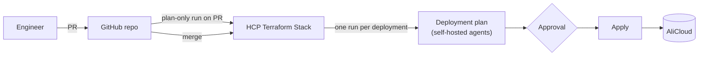
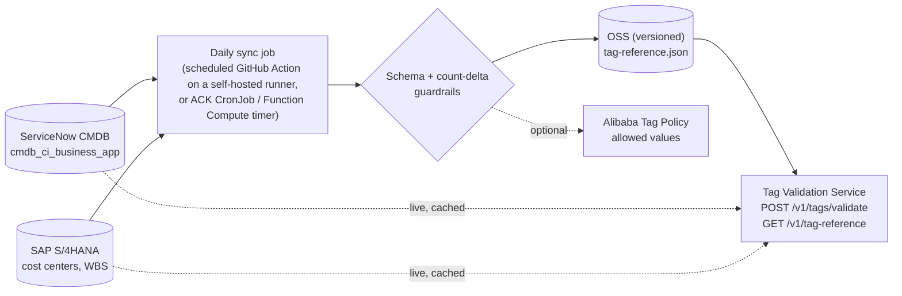
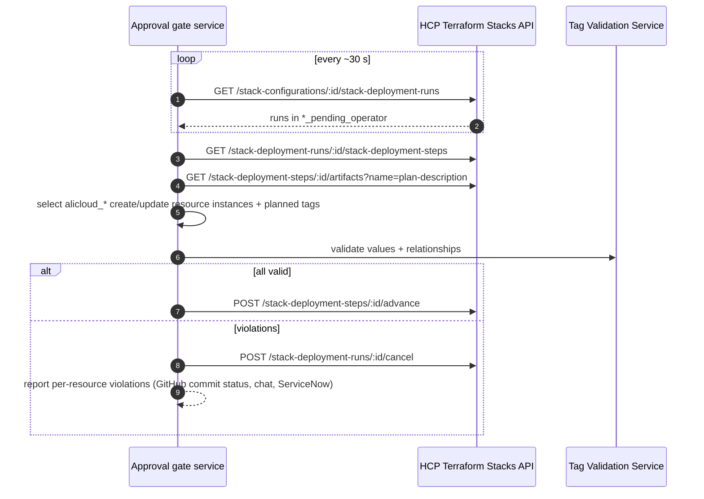
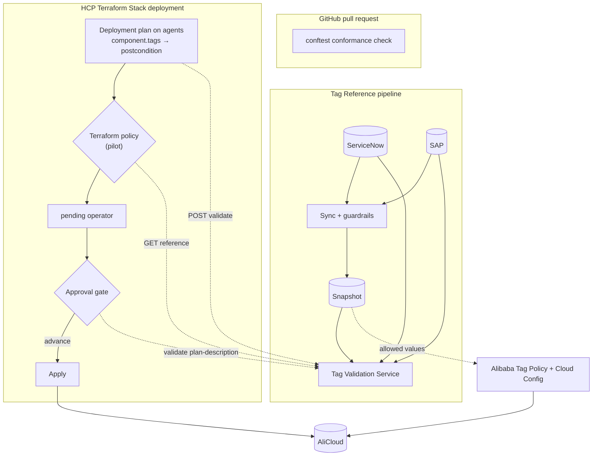

# Validating ServiceNow and SAP tag values on AliCloud with HCP Terraform Stacks

| | |
|---|---|
| **Status** | Proposal for review |
| **Date** | 2026-09-28 |
| **Scope** | AliCloud infrastructure deployed with **HCP Terraform Stacks** (VCS-driven from GitHub, self-hosted agents, manual approval before apply) |
| **Question** | How do we check, at plan and apply time, that mandatory tag *values* (application owner, business owner, cost center, WBS code, …) are valid in ServiceNow and SAP, with a daily static file as a fallback? |
| **Reference code** | [`examples/`](../examples/). Every example is tested; run [`examples/run-tests.sh`](../examples/run-tests.sh) |

---

## 1. Summary

**The gap:** Checking that a tag *exists* is easy. The hard part is proving the value is *true*: that the owner really owns the application in ServiceNow, that the cost center is active in SAP, and that the WBS element is released and belongs to that cost center.

**What Stacks change:** HCP Terraform Stacks support **neither run tasks nor Sentinel/OPA policy sets**. The only policy engine for Stacks is the **beta** Terraform policy framework. The usual central gates are not available, so for Stacks the checks have to live in four other places:

| # | Option | What it gives you | Verdict |
|---|---|---|---|
| **1** | **Tag validation component + PR conformance check** | A `tags` component validates each deployment's tags **live** against ServiceNow/SAP from your self-hosted agents. Every AliCloud component consumes its output, so a deployment cannot plan with bad tags, and neither can the PR speculative plan. A `conftest` check on PRs stops component modules from bypassing it. Uses only GA features and works on any plan. | ⭐ **Primary gate. Ship first.** |
| **2** | **Deployment approval gate (Stacks API)** | This replaces run tasks for Stacks. A service watches deployment runs waiting for approval, reads each step's `plan-description`, validates every `alicloud_*` resource, then **advances** or **cancels** the run. It is central, independent of the Stack configuration, and sees everything in the plan. | ✅ **Add next**, after a short spike confirms the plan artifact format |
| **3** | **Terraform policy (beta) policy set** | The native Stacks policy engine: `resource_policy "alicloud_*"` with a live lookup through `core::gethttprequest`. | 🧪 **Pilot now** on a non-production Stack; make it mandatory at GA |
| **4** | **Alibaba Cloud Tag Policy + Cloud Config** | Blocks wrong values for a subset of resource types at the cloud API. Flags missing or invalid tags everywhere else, including resources created outside Terraform, and drift. | ✅ Runtime backstop |

All four share one **Tag Reference pipeline** (section 4): ServiceNow + SAP feed cached live lookups plus a daily snapshot, and that snapshot is the static fallback you asked for.

**Decisions still open** (section 10): the HCP Terraform plan (Premium enables policy evaluation on your agents and deployment-group auto-approve rules), adopting an `ApplicationID` anchor tag, and who may approve Stack runs.

---

## 2. Context and assumptions



### 2.1 Tag contract (assumed; adjust key names to your standard)

| Tag key | Source of truth | Rule to enforce |
|---|---|---|
| `ApplicationID` *(recommended new anchor)* | ServiceNow `cmdb_ci_business_app.number`, e.g. `APM0001234` | Exists and is operational |
| `ApplicationOwner` | ServiceNow `cmdb_ci_business_app.it_application_owner` | Equals the IT owner **of that application** |
| `BusinessOwner` | ServiceNow `cmdb_ci_business_app.owned_by` | Equals the business owner **of that application** |
| `CostCenter` | SAP S/4HANA cost center master data | Exists, is valid today, and is not locked |
| `WBSCode` | SAP S/4HANA WBS element (Enterprise Project) | Exists, is released, and belongs to `CostCenter` (if that is your finance rule) |

> **Why add `ApplicationID`?** Without an anchor you can only ask "is this a real person or a real cost center?", so `ApplicationOwner = <any employee>` would pass. With the anchor, owners and finance codes are checked **against each other**, which is what FinOps and the CMDB need. It also makes every cloud resource joinable to its CMDB record.

### 2.2 Where a check can run in a Stack

| Moment | Mechanism available to Stacks | Option |
|---|---|---|
| **PR opened** | *Automatic speculative plans* create plan-only runs for PRs. A failing component plan or Terraform policy makes that run fail. The conformance check runs in GitHub Actions. | 1, 3 |
| **Deployment plan** | Component postconditions (plan fails); Terraform policy after each deployment plan | 1, 3 |
| **Approval** | Runs wait in `pre_deploying_pending_operator` / `deploying_pending_operator`. An external gate can advance or cancel them through the API. | 2 |
| **Apply** | Alibaba Cloud pre-event interception on supported resource types | 4 |
| **After apply / continuously** | Cloud Config rules, drift and console changes | 4 |

---

## 3. Platform facts that drive the design

Verified on 2026-09-28 against the live HashiCorp documentation (plus its source repo `hashicorp/web-unified-docs` @ `d3a810d`), HashiCorp's API client (`go-tfe`), the Terraform source, the Alibaba Cloud documentation, and the provider schemas. See [Sources](#sources).

**HCP Terraform Stacks**

| # | Fact | Design impact |
|---|---|---|
| S1 | Stacks vs workspaces feature support: **run tasks ❌, policy as code ❌, drift detection ❌**, self-hosted agents ✅ (agent *hooks* ❌). | No run task or Sentinel/OPA gate. Validation runs in components, an external gate, Terraform policy, or the cloud. |
| S2 | Policy enforcement for Stacks uses **Terraform policy only** (beta). It evaluates only after each deployment plan: nothing before the plan, nothing after the apply, and mandatory-overridable failures can't be overridden. It needs **Terraform 1.17 or later** (currently pre-release: 1.17.0-beta2). | Suitable for a pilot, not for production yet. |
| S3 | Stacks can create **plan-only runs for pull requests** ("Automatic speculative plans"). | Component-level failures show up on the PR, before merge. |
| S4 | Stack `variable` blocks (`*.tfcomponent.hcl`) have **no `validation` argument**. Component modules support normal `validation`, `precondition`/`postcondition` and data sources. | Validation must live inside component modules. |
| S5 | `deployment_auto_approve` rules (deployment groups, **Premium**) see only `context.plan.changes`/`component_changes` counts, `success`, `errors` and `warnings`, **not attribute values**. | They can't validate tags, but they can refuse auto-approval when a component reports errors or warnings. |
| S6 | Stacks API: deployment steps expose a **`plan-description`** artifact. Steps in `pending-operator` can be **advanced** (approved), and runs can be **cancelled** or approved. No Stack notifications/webhooks are documented, so an integration has to poll. The artifact's JSON schema is **not documented**. Terraform core's Stack planned-change messages carry each resource instance's type, actions and planned values. | Option 2 is feasible, but spike the artifact format first. |
| S7 | Policy evaluations (including Terraform policy on Stacks) run **on your agents** only on **Premium**, with agent execution mode and agents accepting `policy` jobs. Otherwise they run in HCP infrastructure. | Terraform policy lookups against a private API need Premium; otherwise the endpoint must be internet-reachable with a token. |

**Terraform policy tooling (`tfpolicy` 0.3.0, found while testing)**

| # | Fact | Design impact |
|---|---|---|
| T1 | `core::gethttprequest(url, headers)` is GET only, and its second argument **is the header map itself**. The documented example that wraps it in `{ headers = {...} }` fails on 0.3.0. There is no `urlencode` function. | Fetch reference data once per evaluation rather than sending tag values in query strings. |
| T2 | `tfpolicy` validates `resource_policy "alicloud_*"` against the **real provider schema**. Of 1,208 AliCloud resource types only **238** have a map `tags` attribute, and `alicloud_mse_nacos_config` uses a string. | Guard every tag read with `core::try`/`core::can` (done in the example). |

**AliCloud and Alibaba Cloud**

| # | Fact | Design impact |
|---|---|---|
| A1 | The AliCloud provider has **no provider-level `default_tags`**. 238 of 1,208 resource types (provider 1.293.0) have a map `tags` attribute, including VPC, ECS, OSS, RDS, ACK, SLB, RAM roles and users. Types such as security group rules, route entries and RAM policy attachments have none. | Tags must be passed per resource. Generate the taggable list from the provider schema (done in the example). |
| A2 | Tag values: ≤ 128 characters; letters, digits, spaces and `_ . # / = + - @`; may not start with `aliyun` or `acs:`. Default quota: 20 tags per resource (varies by type). | Email owners and WBS codes such as `P-100234.01` are valid tag values. |
| A3 | **Tag Policy** (`alicloud_tag_policy`): policy keys must be lowercase and `tag_key` carries the case-sensitive name. Regex rules (`matched_tags`) detect and remediate but **cannot intercept**. By default, pre-event interception (`enforced_for`) blocks only a *wrong value* on a key that is present. *Strong validation*, which also blocks *missing* tags, is off by default, applies to the whole Resource Directory, and covers only ECS-family, ESS, ECI and ROS create APIs. | Allow-lists only, with no relational checks. |
| A4 | Interception coverage: at **create** time it covers the ECS family, RDS, Tair, ESS, ECI and ROS stacks. VPC, vSwitch, route table, NAT, EIP, SLB, ALB, CEN and MongoDB are checked only on **`TagResources`**. **OSS, PolarDB, NAS, ACK clusters, CDN, API Gateway and DNS have none.** Alibaba warns interception can break ESS/ACK autoscaling. | Cloud-side blocking is partial, so it stays a backstop. |
| A5 | **Cloud Config** `required-tags` checks up to **6** key/value pairs (AND logic), is triggered by configuration change, and supports remediation. Custom rules invoke a Function Compute handler, which returns results via `PutEvaluations`. | Five mandatory keys fit one managed rule. Value checks need a custom rule. |

**HCP Terraform plans:** run tasks are on all plans, policy enforcement on **Standard** and **Premium** only, audit logging on **Premium** only, and concurrent agent runs are Essentials 1, Standard 10, Premium 300.

---

## 4. Shared foundation: the Tag Reference pipeline

Every option needs the same trusted data. Build it once, and it becomes the static fallback you asked for.



- **Extract (read-only technical users):**
  - *ServiceNow Table API:* `GET /api/now/table/cmdb_ci_business_app?sysparm_query=<operational filter>&sysparm_fields=number,it_application_owner.email,owned_by.email`. Dot-walked fields in `sysparm_fields` return owner emails in one call.
  - *SAP S/4HANA:* cost centers (valid today, not locked) come from the cost center master-data API. WBS elements (released, with responsible cost center) come from the Enterprise Project API (`API_ENTERPRISE_PROJECT_SRV;v=0002` → `A_EnterpriseProjectElement`). Confirm the exact services for your edition on the SAP Business Accelerator Hub, and prefer SAP API Management or Integration Suite over calling S/4 directly.
- **Normalize:** lower-case emails, trim values, keep only active/released records, and record `generated_at` plus source counts.
- **Guardrails before publishing:** validate against a JSON schema, and **refuse to publish if record counts drop by more than ~5%**. A bad extract must never block every deployment.
- **Tag Validation Service:** a small internal API on ACK or Function Compute, reachable from the self-hosted agents. It answers from a cache (~15 min TTL) refreshed from ServiceNow/SAP, and falls back to the latest snapshot (≤ 48 h) if a source is down. It exposes `POST /v1/tags/validate` (Option 1), `GET /v1/tag-reference` (Option 3), and the logic the approval gate reuses (Option 2).
- **Snapshot shape:** see [`examples/tag-reference/tag-reference.sample.json`](../examples/tag-reference/tag-reference.sample.json). Applications keyed by `ApplicationID` with their owners, cost centers, and WBS elements with their cost center.

---

## 5. Options for Stacks

### Option 1 ⭐: Tag validation component + PR conformance check (primary gate)

**How it works.** Each deployment declares its mandatory tags as a Stack input. A `tags` component, the [golden tags module](../examples/stack/modules/tags/main.tf), posts them to the Tag Validation Service through `data "http"` with a `postcondition`, and outputs the validated map. Every AliCloud component takes `tags = component.tags.tags`, so it cannot plan without valid tags. With the Stack in **Agent** execution mode, the lookup runs inside your network, so no Premium features or inbound exposure are needed.

```hcl
# components.tfcomponent.hcl (full Stack: examples/stack/)
component "tags" {
  source = "./modules/tags"
  inputs = {
    tags               = var.tags
    validation_api_url = var.tag_validation_api_url
  }
  providers = { http = provider.http.this }
}

component "network" {
  source = "./modules/network"
  inputs = {
    name       = "app"
    cidr_block = "10.0.0.0/16"
    tags       = component.tags.tags # validated map only
  }
  providers = { alicloud = provider.alicloud.this }
}
```

**Closing the bypass.** A component module could still write tags inline. The [conformance check](../examples/conformance/policy/component_tags.rego) runs `conftest` on PRs: every taggable `alicloud_*` resource must set `tags = var.tags` or `merge(<extras>, var.tags)` (mandatory keys last, so they win). The taggable list is [generated from the provider schema](../examples/conformance/scripts/generate_taggable.py). Make the check a required status in branch protection, and put component modules under CODEOWNERS.

- **Tests:** `terraform stacks validate` passes on the example Stack. The module has a `terraform test` suite (3/3: valid tags plan; invalid values fail the plan; a bad `ApplicationID` format fails variable validation). `conftest` passes the good fixtures and the Stack's network module, and reports all three bad fixtures (inline tags, missing tags, mandatory keys overridden).
- **Different tags within one Stack:** if components belong to different cost centers or WBS codes, use one `tags` component per tag set (or `for_each`) and wire each AliCloud component to the right one.
- **If you use auto-approve rules (Premium):** include `context.success == true` and `length(context.warnings) == 0` so tag problems never auto-approve.

| ✅ Pros | ⚠️ Cons |
|---|---|
| Live, relational checks with the exact tag named in the plan error, on PR plans too | Relies on a convention; the conformance check and CODEOWNERS enforce it, so a disabled check means no validation |
| Only GA features (modules, `data "http"`, postconditions); works on any plan through your agents | `data.http` arguments and responses are stored in Stack state: send only tag values, and authenticate at the network level (agents only, or mTLS) rather than with bearer tokens |
| Solves AliCloud's missing `default_tags` with one validated tag map | Plans fail if the service is down (mitigated by the snapshot fallback inside the service) |

**Effort:** Small.

---

### Option 2: Deployment approval gate on the Stacks API (the run-task replacement)

**How it works.** A small service polls HCP Terraform for Stack deployment runs waiting for approval, validates the planned AliCloud resources, then approves or rejects them.



- **Two modes.** In *guard* mode the gate only cancels non-compliant runs, and people keep approving compliant ones. In *approver* mode the gate approves compliant runs, and only a break-glass team keeps approve rights, which removes the race where a person approves before the gate cancels.
- **Spike first (1–2 days).** The `plan-description` schema is undocumented (S6). On a sandbox Stack, confirm that it contains each resource instance's type, action and planned `tags`, as Terraform core's Stack planned-change messages do, and pin the gate to the observed shape with contract tests.
- **Reuse:** the plan-selection and outcome logic mirrors the tested [workspace run task handler](../examples/workspaces/run-task/runtask.py). Only the plan source (artifact instead of plan JSON) and the verdict call (advance/cancel instead of callback) change.

| ✅ Pros | ⚠️ Cons |
|---|---|
| Central: independent of how components are written, and sees every resource in the plan | Built on an **undocumented** artifact format that may change; needs contract tests and monitoring |
| Runs in your network with outbound calls only; works on any plan | Polling (no Stack webhooks) adds latency; you own another service and a team token with approve/cancel rights |
| Per-resource violation messages; can also report on PR speculative runs via a commit status | Needs clear approval-rights design to avoid people approving around it |

**Effort:** Medium (after the spike).

---

### Option 3: Terraform policy (beta), the native Stacks policy engine

**How it works.** A Terraform policy set scoped to your Stacks evaluates after each deployment plan. The [policy](../examples/terraform-policy/policies/alicloud-mandatory-tags.policy.hcl) fetches the current reference data once per evaluation (`GET /v1/tag-reference`, from the service's cache), then checks presence, membership and relationships for every taggable `alicloud_*` resource. If the service is unreachable, it **fails closed** with a clear message.

```hcl
resource_policy "alicloud_*" "mandatory_tags" {
  operations        = ["create", "update"]
  enforcement_level = "mandatory"
  filter            = core::can(attrs.tags) && !core::can(core::lower(attrs.tags)) # map or null tags only

  locals {
    tags    = core::try(core::merge({}, attrs.tags), {})
    missing = [for k in input.mandatory_tags : k if core::try(local.tags[k], "") == ""]
    # ... ApplicationID / owners / CostCenter / WBS lookups against local.ref
  }

  enforce {
    condition     = core::length(local.missing) == 0
    error_message = "Missing mandatory tags: ${core::join(", ", local.missing)}"
  }
  # ... one enforce block per rule (see the full policy)
}
```

- **Tests:** `tfpolicy test` 0.3.0 passes 6/6 against the AliCloud 1.293.0 schema: valid tags pass; missing, null, relational-mismatch and unknown-cost-center cases fail; untaggable types are skipped. Separate checks confirmed that the valid resource genuinely passes, and that an unreachable service fails closed.
- **Constraints (S2, S7):** beta ("do not use beta features in production"); Stacks need a Terraform 1.17 pre-release; plan-phase only; no overrides on Stacks. Evaluation runs in HCP infrastructure unless you are on Premium with agents, so the reference endpoint must be reachable from HCP (token-protected) or you need Premium.
- **At GA** this becomes the natural central gate and can replace Option 2, keeping Option 1 for developer feedback.

**Effort:** Small (pilot).

---

### Option 4: Alibaba Cloud Tag Policy + Cloud Config (runtime backstop)

**How it works.** A platform Stack or workspace renders an [`alicloud_tag_policy`](../examples/alibaba-tag-policy/main.tf) from the daily snapshot. It combines allow-lists with interception for low-cardinality keys (`CostCenter`, `ApplicationID`) on types that support create-time interception (e.g. `ecs:instance`, `rds:instance`), and regex detection for high-cardinality keys such as `WBSCode`. **Cloud Config** runs `required-tags` for presence, plus a Function Compute custom rule that checks values against ServiceNow/SAP.

- **Tests:** `terraform validate` passes against `aliyun/alicloud` 1.293.0. Policy-key casing, `required-tags` parameters (`tag1Key` … `tag6Key`) and resource type codes were checked against the Alibaba Cloud docs.
- A wrong value is rejected with `Forbidden.TagPolicy`. A *missing* key is not blocked unless strong validation is enabled (A3). Pilot on one non-production member, and check ESS/ACK scaling.

| ✅ Pros | ⚠️ Cons |
|---|---|
| Covers console, CLI, other tools, drift and **existing** resources | Allow-lists and regex only: **no relational checks** |
| Enforced by the cloud API for intercepted types; Cloud Config provides the compliance inventory | **Partial coverage** (A4); failures surface **mid-apply**; can break autoscaling that attaches its own tags |

**Effort:** Small to medium.

---

## 6. Side-by-side comparison (Stacks)

| Criterion | 1 Tag component ⭐ | 2 Approval gate | 3 Terraform policy (beta) | 4 Alibaba Tag Policy / Config |
|---|---|---|---|---|
| Live ServiceNow/SAP data | ✅ | ✅ | ✅ (service cache) | ❌ daily allow-lists |
| Relational checks | ✅ | ✅ | ✅ | ❌ |
| Fails the PR plan | ✅ | ⚠️ via a commit status it posts | ✅ | ❌ |
| Blocks before apply | ✅ plan fails | ✅ cancels the run | ✅ policy fails | ⚠️ during apply, wrong values only, subset of types |
| Can it be bypassed? | Only if the conformance check is skipped | Not by configuration; depends on who holds approve rights | No, for Stacks in scope | No, for intercepted types |
| Production-ready today | ✅ GA features | ⚠️ undocumented artifact | ❌ beta, Terraform 1.17 pre-release | ✅ |
| Minimum HCP Terraform plan | Any (uses your agents) | Any | Standard; Premium to run on agents | n/a |
| Private SNOW/SAP reachability | ✅ via agents | ✅ runs in your network | Premium agents, else public endpoint | Function Compute in your VPC |
| New component to operate | Tag Validation Service | + gate service | Service endpoint | None |
| Failure UX | Plan error naming the tag | Run cancelled + report | Policy failure per resource | Cloud API error |
| Effort | S | M | S | S–M |

---

## 7. If some infrastructure stays on workspaces

Workspaces support run tasks and Sentinel/OPA, so the strongest options there are:

- **Custom run task** (post-plan + pre-apply, mandatory) backed by the same Tag Validation Service. Handler sketch: [`examples/workspaces/run-task/`](../examples/workspaces/run-task/) (HMAC, plan fetch, per-resource outcomes; tested against a fake HCP Terraform API). A run task can source requests from your agents only on Premium; otherwise it allowlists HCP's `notifications` IP ranges.
- **Sentinel policy set on the daily snapshot** as the quick win and safety net: [`examples/workspaces/sentinel/`](../examples/workspaces/sentinel/) (6/6 tests on Sentinel 0.41.0 and 0.40.0), or the **OPA** equivalent: [`examples/workspaces/opa/`](../examples/workspaces/opa/) (7/7). Policy enforcement needs Standard or Premium.
- The golden tags module and the conformance check work unchanged for workspaces.

---

## 8. Recommended target architecture and rollout



**Phased rollout** (timings indicative)

| Phase | Weeks | Deliverables | Exit criteria |
|---|---|---|---|
| 0: Decide | 0 | Tag contract and `ApplicationID` anchor; plan tier; approval-rights model; fail-closed rules; exception process | Signed off by FinOps and CMDB owners |
| 1: Baseline | 1–3 | Sync job + snapshot; Tag Validation Service (`validate` + `reference`); `tags` component in every Stack; conformance check **required** in branch protection; automatic speculative plans on | All Stacks' deployments validated on every plan and PR |
| 2: Central gate | 3–6 | Spike on `plan-description`; approval gate in *guard* mode, then *approver* mode if wanted; Terraform policy pilot on a non-production Stack | Non-compliant runs cancelled automatically; pilot findings logged |
| 3: Backstop | 6–10 | Cloud Config `required-tags` + custom Function Compute rule (detect first); Tag Policy interception for ECS/RDS on one member; remediation campaign for existing resources | Compliance dashboard > 95% |
| 4: Converge | At GA | Terraform policy mandatory on all Stacks; decide whether to keep the approval gate as defense in depth | Decision record |

> **Existing resources:** plan-time checks only see resources that change. Use Option 4's inventory to drive the backfill, and roll out the component on new deployments first.

---

## 9. Operations and security checklist

**Failure modes (fail safe, with a break-glass path)**

| Failure | Tag component (1) | Approval gate (2) | Terraform policy (3) |
|---|---|---|---|
| ServiceNow/SAP down | Service answers from the snapshot; no impact | Same | Same |
| Snapshot job failing | Live checks continue; alert at 26 h | Same | Same |
| Tag Validation Service down | Plans fail closed. Run ≥ 2 replicas across zones. **Break-glass:** an approved change points `tag_validation_api_url` at a standby instance that serves the last snapshot | Runs stay pending, so nothing is approved. **Break-glass:** a named team approves manually | Policy fails closed. **Break-glass:** set the pilot policy to advisory |
| Gate service down | n/a | Guard mode: people keep approving as today. Approver mode: runs wait until the break-glass team approves | n/a |

- **Secrets:** ServiceNow/SAP read-only OAuth clients live in Alibaba **KMS Secrets Manager**, never in Stack inputs. The gate's HCP team token is scoped to the Stacks' project and rotated. The Terraform policy input token is marked `sensitive`.
- **Network:** the Tag Validation Service is internal-only and reachable from agents and the gate. Expose `GET /v1/tag-reference` publicly (token-protected) only if the Terraform policy pilot runs in HCP infrastructure (non-Premium).
- **State hygiene:** `data.http` request bodies and responses land in Stack state, so send only tag values and never credentials.
- **Integrity of the snapshot:** a bot identity with signed commits or uploads, plus schema and count-delta checks before publishing.
- **Correctness details:** tags must be **known at plan time**. Terraform omits unknown values from the plan and flags them separately, and the reference policies treat that as a violation. Alibaba tag keys and values are case-sensitive, so normalize owner emails.
- **Observability:** validation latency, source error rate, snapshot age, gate decisions (approved or cancelled, per Stack), and violations per project. On Premium, audit trails also record approvals.

---

## 10. Open decisions

1. HCP Terraform **plan** (Standard vs Premium): this decides where Terraform policy runs and whether deployment-group auto-approve rules are available.
2. Final **tag keys**, adoption of `ApplicationID`, and whether tags are per deployment or per component.
3. **Approval rights:** guard mode or approver mode, and who keeps break-glass approval.
4. Appetite for a **Terraform 1.17 pre-release** on a non-production Stack for the Terraform policy pilot.
5. Which **relational rules** are mandatory (e.g. WBS → cost center), and the fail-closed thresholds.
6. **SAP access path** (API Management, Integration Suite, or direct OData) and ownership of the sync job and service.
7. **Backfill strategy** for existing resources.

---

## Reference implementations

All under [`examples/`](../examples/); [`examples/run-tests.sh`](../examples/run-tests.sh) runs every test. See [`examples/README.md`](../examples/README.md).

| Path | What it is | Tested with |
|---|---|---|
| [`stack/`](../examples/stack/) | Stack with a `tags` component feeding an AliCloud component (OIDC auth, agent-friendly) | `terraform stacks validate` (Terraform 1.16.4) |
| [`stack/modules/tags/`](../examples/stack/modules/tags/) | Golden tags module (`data "http"` + postcondition) | `terraform test` 3/3 with `hashicorp/http` 3.6.2 |
| [`conformance/`](../examples/conformance/) | PR check: taggable resources must use `var.tags` | `conftest` 0.70.1: good fixtures pass, 3/3 bad ones fail |
| [`terraform-policy/`](../examples/terraform-policy/) | Terraform policy (beta) for Stacks | `tfpolicy test` 0.3.0: 6/6 |
| [`alibaba-tag-policy/`](../examples/alibaba-tag-policy/) | Tag Policy + Cloud Config from the snapshot | `terraform validate`, `aliyun/alicloud` 1.293.0 |
| [`workspaces/`](../examples/workspaces/) | Run task handler, Sentinel and OPA policies (workspaces only) | Python fake-API test; Sentinel 6/6; OPA 7/7 |
| [`mock-api/`](../examples/mock-api/) | Local stand-in for the Tag Validation Service used by the tests | n/a |

---

## Sources

All sources were read on 2026-09-28.

HashiCorp, Stacks:
- [Workspaces vs Stacks feature support](https://developer.hashicorp.com/terraform/cloud-docs/stack-workspace) · [Policy enforcement for Stacks](https://developer.hashicorp.com/terraform/cloud-docs/stacks/policy-enforcement) · [Configure Stacks (speculative plans, execution mode)](https://developer.hashicorp.com/terraform/cloud-docs/stacks/configure) · [Stack runs and statuses](https://developer.hashicorp.com/terraform/cloud-docs/stacks/runs)
- [Deployment run conditions](https://developer.hashicorp.com/terraform/language/stacks/deploy/conditions) · [`deployment_auto_approve` reference](https://developer.hashicorp.com/terraform/language/block/stack/tfdeploy/deployment_auto_approve) · [Stack `variable` block](https://developer.hashicorp.com/terraform/language/block/stack/tfcomponent/variable) · [Stack `component` block](https://developer.hashicorp.com/terraform/language/block/stack/tfcomponent/component) · [Authenticate a Stack (OIDC)](https://developer.hashicorp.com/terraform/language/stacks/deploy/authenticate)
- [Stack deployments API (runs, steps, artifacts, advance, cancel)](https://developer.hashicorp.com/terraform/cloud-docs/api-docs/stacks/deployments) · [`go-tfe` stack deployment steps](https://github.com/hashicorp/go-tfe/blob/v1.111.2/stack_deployment_steps.go) · [Terraform Stacks planned-change schema (`stacks.proto`)](https://github.com/hashicorp/terraform/blob/main/internal/rpcapi/terraform1/stacks/stacks.proto)

HashiCorp, Terraform policy:
- [Compare policy frameworks](https://developer.hashicorp.com/terraform/policy/compare) · [`core::gethttprequest`](https://developer.hashicorp.com/terraform/policy/reference/functions/gethttprequest) · [`resource_policy`](https://developer.hashicorp.com/terraform/policy/reference/policy/resource-policy) · [Policy tests](https://developer.hashicorp.com/terraform/policy/reference/test) · [Install `tfpolicy`](https://developer.hashicorp.com/terraform/policy/install) · [Terraform policy in HCP Terraform](https://developer.hashicorp.com/terraform/cloud-docs/policy-enforcement/define-policies/terraform-policy)

HashiCorp, general and workspaces:
- [Plans and feature comparison](https://developer.hashicorp.com/terraform/cloud-docs/overview) · [Manage policy sets (evaluations on agents)](https://developer.hashicorp.com/terraform/cloud-docs/policy-enforcement/manage-policy-sets) · [Run tasks](https://developer.hashicorp.com/terraform/cloud-docs/workspaces/settings/run-tasks) · [Run tasks integration API](https://developer.hashicorp.com/terraform/cloud-docs/api-docs/tasks/run-tasks-integration) · [Agent request forwarding](https://developer.hashicorp.com/terraform/cloud-docs/agents/request-forwarding) · [Sentinel `http` import](https://developer.hashicorp.com/sentinel/docs/imports/http)
- [Custom conditions and validation](https://developer.hashicorp.com/terraform/language/validate) · [`terraform test`](https://developer.hashicorp.com/terraform/language/tests) · [`http` data source](https://registry.terraform.io/providers/hashicorp/http/latest/docs/data-sources/http)
- Reference repos: [terraform-run-task-scaffolding-go](https://github.com/hashicorp/terraform-run-task-scaffolding-go) · [terraform-sentinel-policies](https://github.com/hashicorp/terraform-sentinel-policies) (incl. [`http-examples`](https://github.com/hashicorp/terraform-sentinel-policies/tree/main/cloud-agnostic/http-examples)) · [aws-ia/terraform-aws-runtask-iam-access-analyzer](https://github.com/aws-ia/terraform-aws-runtask-iam-access-analyzer)
- [Conftest](https://www.conftest.dev/) (HCL2 parser)

Alibaba Cloud:
- Tag policies: [overview and supported services / interception coverage](https://www.alibabacloud.com/help/en/resource-management/tag/user-guide/overview) · [syntax](https://www.alibabacloud.com/help/en/resource-management/tag/user-guide/syntax-of-a-tag-policy) · [pre-event interception and strong validation](https://www.alibabacloud.com/help/en/resource-management/tag/user-guide/enable-tag-compliance-enforcement) · [CreatePolicy API](https://www.alibabacloud.com/help/en/resource-management/tag/developer-reference/api-tag-2018-08-28-createpolicy) · [tag limits](https://www.alibabacloud.com/help/en/resource-management/product-overview/limits)
- Cloud Config: [`required-tags`](https://www.alibabacloud.com/help/en/cloud-config/latest/b5m012) · [custom function rules](https://www.alibabacloud.com/help/en/cloud-config/latest/custom-rule-functions) · [supported resource types](https://www.alibabacloud.com/help/en/cloud-config/latest/alibaba-cloud-services-that-are-supported-by-cloud-config)
- Provider: [aliyun/terraform-provider-alicloud](https://github.com/aliyun/terraform-provider-alicloud) · [`alicloud_tag_policy`](https://registry.terraform.io/providers/aliyun/alicloud/latest/docs/resources/tag_policy) · [`alicloud_config_rule`](https://registry.terraform.io/providers/aliyun/alicloud/latest/docs/resources/config_rule)

ServiceNow and SAP (guidance only; confirm against your instance and S/4HANA edition):
- ServiceNow: [Dot-walking in the REST Table API](https://developer.servicenow.com/blog.do?p=%2Fpost%2Fdot-walking-in-the-rest-table-api-2%2F) · [Table API reference](https://www.servicenow.com/docs/r/api-reference/rest-apis/c_TableAPI.html) · [business application owner fields](https://www.servicenow.com/community/common-service-data-model-forum/purpose-of-added-ba-user-fields-quot-it-application-owner-quot/m-p/334798)
- SAP: [Enterprise Project API](https://help.sap.com/docs/SAP_S4HANA_CLOUD/988903b47d7040f6ac4ec02e44bb58e4/b467d86283be4a56869f1e6784e47b64.html) · [Cost center APIs in S/4HANA Cloud](https://community.sap.com/t5/enterprise-resource-planning-blog-posts-by-sap/a-practical-guide-to-cost-center-apis-in-sap-s-4hana-cloud/ba-p/14229337) · [APIs on SAP Business Accelerator Hub](https://help.sap.com/docs/SAP_S4HANA_ON-PREMISE/8308e6d301d54584a33cd04a9861bc52/1e60f14bdc224c2c975c8fa8bcfd7f3f.html)
